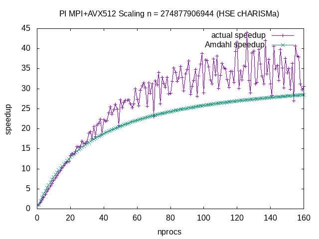

# Отчёт по практикуму

## Определение латенси (среднее значение и распределение) 

Функция `discoverTopology()`:

* Находим имя хоста для каждого процесса
* Группируем процессы с одинаковым именем хоста 

Программа `latency`:

* Измеряем латентность каждого с каждым
* Находим минимум, максимум, среднее внутри групп и между группами

Латентность вычисляем как разность времён пересылки одного большого сообщения и такого же сообщения, разбитого на малые части, делённую на размер.

## Определение пропускной способности (зависимость от размера сообщения и максимальное значение)

Программа `throughput()`:

* Измеряем пропускную способность каждого с каждым, пересылки между процессами на одном узле помечены `[INTERNODE]`, на разных узлах - `[INTRANODE]`(полный лог - `figures/throughput.log`)

```
rank 3 (pid = 294901) @ hostname "cn-012", together with 2 other ranks: 19 32
Testing point-to-point performance, message size = 16777216 bytes:
[INTERNODE] 3 -> 0 time = 0.027095 sec (590.518158 MB/sec)
[INTERNODE] 3 -> 1 time = 0.016583 sec (964.852112 MB/sec)
[INTERNODE] 3 -> 2 time = 0.016509 sec (969.173022 MB/sec)
[INTERNODE] 3 -> 4 time = 0.051839 sec (308.647100 MB/sec)
...
[INTERNODE] 3 -> 15 time = 0.030316 sec (527.766738 MB/sec)
[INTERNODE] 3 -> 16 time = 0.041343 sec (387.005726 MB/sec)
[INTERNODE] 3 -> 17 time = 0.041184 sec (388.500470 MB/sec)
[INTERNODE] 3 -> 18 time = 0.030293 sec (528.178838 MB/sec)
[INTRANODE] 3 -> 19 time = 0.057062 sec (280.397878 MB/sec)
...
[INTRANODE] 3 -> 32 time = 0.039978 sec (400.219400 MB/sec)
```


Скорость пересылки между процессами одного узла не показывает явного преимущества, как этого следовало бы ожидать. Похоже, конфигурация MPI неоптимальна, и пересылает локальные сообщения через общую сеть. Нужно либо найти нужные опции OpenMPI, либо использовать многопоточность внутри узлов.

## Теоретическое ускорение

При рассчете ускорения нам требуется подсчитать количество операций. W=T1= Nn*Top         m=[n/p]<= n/p+1
                                                                        (Wp=7m*Top=(7/n/p+7)Top)
                                                                        
 При 7 операций по данной формуле мы можем рассчитать, что n=10^9, Ttr = 8,84 * 10^-7 s - internode, 4,67 * 10^-6 s (intranode)
 Top= 3 * 10^-10 s

## Вывод

Проведённый анализ даёт общее представление о возможностях сети кластера. Характеристики сети имеют ключевое значение при планировании реализации memory-bound задач. Анализ ограничен оценкой типа точка-точка, что не позволяет выявить узкие места в сетевой топологии. Так, для многих реальных задач характерно совместное использование одной линии (например, сетевой карты Infiniband или свитча) несколькими процессами одновременно.

## Число Пи

* Получаем зависимость ускорения и эффективности в зависимости от числа процессоров и числа разбиений (график)


С точки зрения закона Амдала, параллельный алгоритм состоит из двух функциональных частей: расчёта локального результата и редукции. С ростом числа процессов, время редукции увеличивается (скорее всего логарифмически, т.к. редукция реализуется как дерево сумм), а время расчёта локального результата уменьшается линейно. Если задавать достаточно большой размер задачи, то накладные расходы на редукцию никогда не будут значимы. В противном случае, пересылать данные малого числа разбиений будет накладнее, чем использовать меньше процессов.

Расходы на инициализацию MPI в данном примере оказываются существенно выше редукции, и их следует оценить (например, с помощью отдельного теста) и учитывать при прогнозе ускорения. Если предположить, что расходы на `MPI_Init` на данной системе всегда не более 3-5 секунд (а могут быть и по нескольку минут на больших суперкомпьютерах!), то получаем соответственно следующие оценки и фактические ускорения:




аппроксимировать законом Амдала и теоретической формулой, сделать выводы о значениях коэффициентов, максимальном ускорении, оптимальном числе процессов

## Оптимизация вычисления числа Пи

* (+) оптимизация опциями комиплятора : опция `-O3` для раскрутки цикла: `set(CMAKE_CXX_FLAGS_RELEASE "-g -O3")`
* (+) MPI : параллельная редукция с помощью MPI
* (+) многопоточность : параллельная редукция с помощью OpenMP
* (+) векторизация : векторные операторы C++ из пакета [xsimd](https://github.com/xtensor-stack/xsimd), опция компилятора `-mavx2` (набор векторных инструкций [AVX2](https://en.wikipedia.org/wiki/Advanced_Vector_Extensions#Advanced_Vector_Extensions_2)); На сервере HSE использованы опции avx512.
* (-) оптимизация работы с кешем и памятью : задача полностью вычислительная, кеш и память для данных практически не используются


```
$ ./pi_mpi_1 10000000000
n = 10000000000
pi = 3.141593, err = 3.423928e-13
time = 11.976790 sec
```

```
$ ./pi_mpi_openmp_2 10000000000
n = 10000000000
pi = 3.141593, err = 1.016964e-13
time = 5.048119 sec
```

```
$ ./pi_mpi_openmp_xsimd_3 10000000000
n = 10000000000
pi = 3.141593, err = 5.329071e-15
time = 1.981271 sec
```

* Выводы о направлении дальнейших оптимизаций: по большому счёту оптимизировать больше нечего, но хорошая эффективность реализации не означает, что сам метод удачен. Желательно построить формулу, не использующую дорогую операцию деления.

